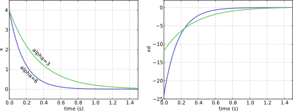
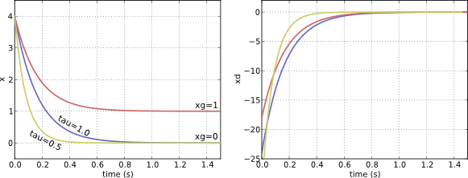
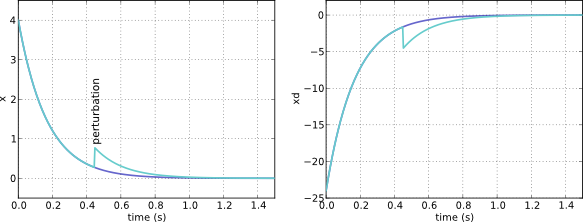

Dynamical Systems
===============

Let a *state* be a vector of real numbers. A dynamical system consists of such a state and a rule that describes how this state will change over time; it describes what future state follows from the current state. A typical example is radioactive decay, where the state   is the number of atoms, and the rate of decay is   proportional to  :  . Here,   is the *decay constant* and   is a shorthand for  . Such an evolution rule describes an implicit relation between the current state  $")  and the state a short time in the future $") .

If we know the initial state of a dynamical system, e.g. =4$") , we may compute the evolution of the state over time through *numerical integration*. This means we take the initial state  , and iteratively compute subsequent states $")  by computing the rate of change  , and integrating this over the small time interval  . A pseudo-code example is shown below for =4$") ,   and  .

	alpha=6; // Decay constant
	dt=0.01; // Duration of one integration step
	x=4.0;   // Initial state
	t=0.0;   // Initial time
	while (t<1.5) {
		dx = -alpha*x; // Dynamical system rule
		x = x + dx*dt; // Project x into the future for
		               // a small time step dt (Euler integration)
		t = t + dt;    // The future is now!
	}
                           
This procedure is called *integrating the system*, and leads the trajectory plotted below (shown for both   and  .

The evolution of many dynamical systems can also be determined analytically, by explicitly solving the differential equation. For instance,  = x_0e^{-\alpha t}$")  is the solution to  . Why? Let's plug  = x_0e^{-\alpha t}$")  into  , which leads to  = -\alpha (x_0e^{-\alpha t})$") . Then derive the left side of the equations, which yields  = -\alpha (x_0e^{-\alpha t})$") . QED. Note that the solution works for arbitrary  . It should, because the solution should not depend on the initial state.

Properties and Features of Linear Dynamical Systems
---------------

### Convergence towards the Attractor

In the limit of time, the dynamical system for exponential decay will converge to 0 (i.e.  = x_0e^{-\alpha\infty} = 0$") ). The value 0 is known as the *attractor* of the system. For simple dynamical systems, it is possible to *prove* that they will converge towards the attractor.

Suppose that the attractor state in our running example is not 0, but 1. In that case, we change the attractor state of the exponential decay to   (  =goal) and define the following differential equation: 

 &amp; \mbox{~with attractor } x^g \end{eqnarray*}") 

This system will now converge to the attractor state  , rather than 0.

 

### Robustness to Perturbations

Another nice feature of dynamical systems is their robustness to perturbations, which means that they will converge towards the attractor even if they are perturbed. The figure below shows how the perturbed system (cyan) converges towards the attractor state just as the unperturbed system (blue) does.

 

### Changing the speed of convergence: The time constant

The rates of change computed by the differential equation can be increased or decreased (leading to a faster or slower convergence) with a *time constant*, which is usually written as follows:

\\ \dot{x} =&amp; (-\alpha(x-x^g))/\tau \end{eqnarray*}") 

*Remark*. For an exponential system, decreasing the time constant   has the same effect as increasing  . For more complex dynamical systems with several parameters, it is useful to have a separate parameter that changes only the speed of convergence, whilst leaving the other parameters the same.

### Multi-dimensional states

The state   need not be a scalar, but may be a vector. This then represents a multi-dimensional state, i.e. $") . In the code, the size of the state vector \equiv dim(\dot{\mathbf{x}})$")  of a dynamical system is returned by the function DynamicalSystem::dim()

### Autonomy

Dynamical system that do not depend on time are called *autonomous*. For instance, the formula   does not depend on time, which means the exponential system is autonomous.

### Further examples of dynamical systems

Apart from the [exponential system]( http://en.wikipedia.org/wiki/Exponential_decay) described above,  further (first order) linear dynamical systems that are implemented in dmpbbo include a [sigmoid system](http://en.wikipedia.org/wiki/Sigmoid_function), as well as a dynamical system that has a constant velocity (TimeSystem), so as to mimic the passing of time (time moves at a constant rate per time ;-)

 &amp; \mbox{exponential decay/growth} \label{equ_}\\ \dot{x} =&amp; \alpha x (\beta-x) &amp; \mbox{sigmoid} \label{equ_}\\ \dot{x} =&amp; 1/\tau &amp; \mbox{constant velocity (mimics the passage of time)} \label{equ_}\\ \end{eqnarray*}") 

 and sigmoid (purple) dynamical systems.") 

## Second-Order Systems

The <b>order</b> of a dynamical system is the order of the highest derivative in the differential equation. For instance,   is of order 1, because the derivative with the highest order (  ) has order 1. Such a system is known as a first-order system. All systems considered so far have been first-order systems, because the derivative with the highest order, i.e.  , has always been of order 1.

### Spring-Damper Systems

An example of a second order system (which also has terms  ) is a [spring-damper system]( http://en.wikipedia.org/wiki/Damped_spring-mass_system), where   is the spring constant,   is the damping coefficient, and   is the mass:

} \label{equ_}\\ \ddot{x}=&amp; (-kx -c\dot{x})/m &amp; \end{eqnarray*}") 

### Critical Damping

A spring-damper system is called critically damped when it converges to the attractor as quickly as possible without overshooting, as the red plot in [this graph]("http://en.wikipedia.org/wiki/File:Damping_1.svg">http://en.wikipedia.org/wiki/File:Damping_1.svg).

Critical damping occurs when  .

### Rewriting one 2nd Order Systems as two 1st Order Systems

For implementation purposes, it is more convenient to work only with 1st order systems. Fortunately, we can expand the state   into two components   with  , and rewrite the differential equation as follows:

/m \end{array} \right] $") 

With this rewrite, the left term contains only first order derivatives, and the right term does not contain any derivatives. This is thus a first order system. Integrating such an expanded system is done just as one would integrate a dynamical system with a multi-dimensional state: